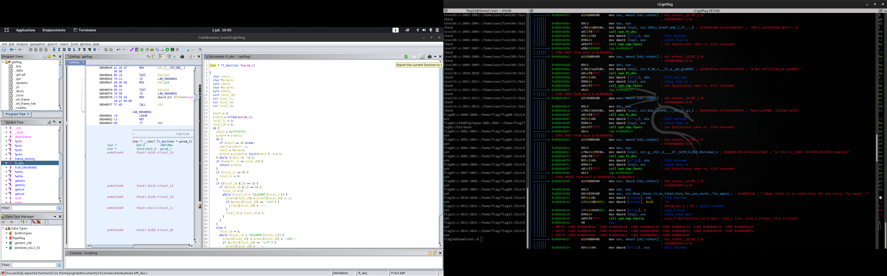

# LEVEL 14

### Reconnaissance

Quand on se connecte au level14, on a **RIEN**, **NADA**

Bon, on va s'attaqué au binaire getflag

On le télécharge sur notre machine et on l'ouvre avec r2:
```
│ │╎│││││   0x08048adc      b86c900408     mov eax, str.Check_flag.Here_is_your_token_: ; 0x804906c ; "Check flag.Here is your token : "
│ │╎│││││   0x08048ae1      8954240c       mov dword [stream], edx     ; FILE *stream
│ │╎│││││   0x08048ae5      c74424082000.  mov dword [nitems], 0x20    ; [0x20:4]=-1 ; 32 ; size_t nitems
│ │╎│││││   0x08048aed      c74424040100.  mov dword [oflag], 1        ; size_t size
│ │╎│││││   0x08048af5      890424         mov dword [esp], eax        ; const void *ptr
│ │╎│││││   0x08048af8      e8c3f9ffff     call sym.imp.fwrite         ; size_t fwrite(const void *ptr, size_t size, size_t nitems, FILE *stream)
│ │╎│││││   0x08048afd      e8aef9ffff     call sym.imp.getuid         ; uid_t getuid(void)
│ │╎│││││   0x08048b02      89442418       mov dword [var_110h], eax
│ │╎│││││   0x08048b06      8b442418       mov eax, dword [var_110h]
│ │╎│││││   0x08048b0a      3dbe0b0000     cmp eax, 0xbbe              ; 3006
│ ────────< 0x08048b0f      0f84b6010000   je 0x8048ccb
│ │╎│││││   0x08048b15      3dbe0b0000     cmp eax, 0xbbe              ; 3006
│ ────────< 0x08048b1a      774c           ja 0x8048b68
│ │╎│││││   0x08048b1c      3dba0b0000     cmp eax, 0xbba              ; 3002
│ ────────< 0x08048b21      0f8414010000   je 0x8048c3b
│ │╎│││││   0x08048b27      3dba0b0000     cmp eax, 0xbba              ; 3002
│ ────────< 0x08048b2c      771f           ja 0x8048b4d
│ │╎│││││   0x08048b2e      3db80b0000     cmp eax, 0xbb8              ; 3000
│ ────────< 0x08048b33      0f84ba000000   je 0x8048bf3
│ │╎│││││   0x08048b39      3db80b0000     cmp eax, 0xbb8              ; 3000
│ ────────< 0x08048b3e      0f87d3000000   ja 0x8048c17
│ │╎│││││   0x08048b44      85c0           test eax, eax
│ ────────< 0x08048b46      747e           je 0x8048bc6
│ ────────< 0x08048b48      e9b9020000     jmp 0x8048e06
│ │╎│││││   ; CODE XREF from main @ 0x8048b2c
│ ────────> 0x08048b4d      3dbc0b0000     cmp eax, 0xbbc              ; 3004
│ ────────< 0x08048b52      0f842b010000   je 0x8048c83
│ │╎│││││   0x08048b58      3dbc0b0000     cmp eax, 0xbbc              ; 3004
│ ────────< 0x08048b5d      0f8744010000   ja 0x8048ca7
│ ────────< 0x08048b63      e9f7000000     jmp 0x8048c5f
│ │╎│││││   ; CODE XREF from main @ 0x8048b1a
│ ────────> 0x08048b68      3dc20b0000     cmp eax, 0xbc2              ; 3010
│ ────────< 0x08048b6d      0f84e8010000   je 0x8048d5b
│ │╎│││││   0x08048b73      3dc20b0000     cmp eax, 0xbc2              ; 3010
│ ────────< 0x08048b78      771b           ja 0x8048b95
│ │╎│││││   0x08048b7a      3dc00b0000     cmp eax, 0xbc0              ; 3008
│ ────────< 0x08048b7f      0f848e010000   je 0x8048d13
│ │╎│││││   0x08048b85      3dc00b0000     cmp eax, 0xbc0              ; 3008
│ ────────< 0x08048b8a      0f87a7010000   ja 0x8048d37
│ ────────< 0x08048b90      e95a010000     jmp 0x8048cef
│ │╎│││││   ; CODE XREF from main @ 0x8048b78
│ ────────> 0x08048b95      3dc40b0000     cmp eax, 0xbc4              ; 3012
│ ────────< 0x08048b9a      0f8403020000   je 0x8048da3
│ │╎│││││   0x08048ba0      3dc40b0000     cmp eax, 0xbc4              ; 3012
│ ────────< 0x08048ba5      0f82d4010000   jb 0x8048d7f
│ │╎│││││   0x08048bab      3dc50b0000     cmp eax, 0xbc5              ; 3013
│ ────────< 0x08048bb0      0f840e020000   je 0x8048dc4
│ │╎│││││   0x08048bb6      3dc60b0000     cmp eax, 0xbc6              ; 3014
│ ────────< 0x08048bbb      0f8424020000   je 0x8048de5
│ ────────< 0x08048bc1      e940020000     jmp 0x8048e06
```

Ici on peux voir la ou on jump en fonction de son uid (3014 = flag14)
```
│ │╎│││││   0x08048bb6      3dc60b0000     cmp eax, 0xbc6              ; 3014
│ ────────< 0x08048bbb      0f8424020000   je 0x8048de5
```

Extrait du fichier /etc/passwd:
```
flag14:x:3014:3014::/home/flag/flag14:/bin/bash
```

Allons voir ce qu'il se passe au jump:
```
0x08048de5      a160b00408     mov eax, dword [obj.stdout] ; obj.stdout__GLIBC_2.0
│ │╎│││││                                                              ; [0x804b060:4]=0
│ │╎│││││   0x08048dea      89c3           mov ebx, eax
│ │╎│││││   0x08048dec      c70424209204.  mov dword [esp], str.g__t61:_4____IF._62FH_G_DCK_Ekrvvdwz_v ; [0x8049220:4]=0x743c2067 ; "g <t61:|4_|!@IF.-62FH&G~DCK/Ekrvvdwz?v|"
│ │╎│││││   0x08048df3      e80cf8ffff     call sym.ft_des
│ │╎│││││   0x08048df8      895c2404       mov dword [oflag], ebx      ; FILE *stream
│ │╎│││││   0x08048dfc      890424         mov dword [esp], eax        ; const char *s
│ │╎│││││   0x08048dff      e82cf7ffff     call sym.imp.fputs          ; int fputs(const char *s, FILE *stream)
```
On a donc une clef qui est envoyer a la fonction ft_des : "g <t61:|4_|!@IF.-62FH&G~DCK/Ekrvvdwz?v|"

On a plus qu'a reconstruire le code et on poura décodé le flag! A la main, on va en avoir pour un moment ... mais des outils existe :).

### Exploitation

On va utilisé Ghidra : https://ghidra-sre.org/

*Ghidra is one of many open source software (OSS) projects developed within the National Security Agency.*

Ghidra va nous décompilé le projet et nous permettre d'extraire la fonction ft_des en C. On a plus qu'a corrigé les éventuelles défaut de compilation.



Après quelques modification, on a plus qu'a compiler:
```
$ gcc ressources/ft_des.c -o getflag
$ ./getflag
flag = 7QiHafiNa3HVozsaXkawuYrTstxbpABHD8CPnHJ
```
En retournant sur notre machine snowcrash:

```
level14@SnowCrash:~$ su flag14
Password: 
Congratulation. Type getflag to get the key and send it to me the owner of this livecd :)
flag14@SnowCrash:~$ getflag 
Check flag.Here is your token : 7QiHafiNa3HVozsaXkawuYrTstxbpABHD8CPnHJ
```

### Exploitation v2

Il est egalement possible d'obtenir le token durant l'execution du binaire. Pour cela il suffit de l'ouvrir avec gdb :
```
$ gdb /bin/getflag
```

Puis de placer un breakpoint juste après l'appel à ptrace :
```
$ b*main+72
```

Puis ensuite de placer un breakpoint sur getuid :
```
$ b*getuid
```

Il suffit maintenant de run le binaire :
```
$ r               <---- run 
```

Nous nous trouvons maintenant sur notre premier breakpoint (celui juste apres ptrace). Comme nous utilisons un debugger, ptrace
va retourner -1 et le programme va exit. La valeur retournée est evidemment stockée dans le registre eax. Il suffit donc de remplacer
sa valeur par 0 :
```
$ set $eax=0
```

Nous avons bypassé ptrace, maintenant, rendons nous sur notre prochain breakpoint (celui sur getuid). 
```
$ c                <----- continue (passer au prochain breakpoint)
```  

Comme nous executons notre binaire avec le user 'level14' nous devons nous attendre à ce que getuid nous renvoi la valeur 2014 dans eax.
Pourquoi 2014 ? Car si nous lisons le contenu de /etc/passwd, nous pouvons voir que l'uid associé au user level14 est 2014. 
Steppons dans le binaire jusqu'à ce que notre registre eax vaille 2014 (0x7de) : 
```
 $ ni                <---- next instruction
 $ ni
 $ i r               <---- permet d'afficher la valeur des regitres et des eflags
```

Nous pouvons maintenant procéder de la même manière que quand nous avons écrasé le retour de ptrace, sauf que cette fois-ci, la valeur qui nous intéresse
est tout simplement la valeur de l'uid du user flag14. Dans /etc/passwd, nous pouvons voir qu'il s'agit de l'uid 3014. Remplacons-le : 
```
 $ set $eax=3014
```

Maintenant il ne nous reste plus qu'à stepper dans le binaire jusqu'à ce que le Saint-Graal fasse son apparition ! : 
``` 
 $ ni                <---- autant de fois que necessaire
```

Check flag.Here is your token : **7QiHafiNa3HVozsaXkawuYrTstxbpABHD8CPnHJ**

Enjoy :)

